## Qué estoy construyendo

Estudio Ingeniería de Software con enfoque en IA, desarrollo de software y ciberseguridad defensiva (blue team / SOC). Este perfil documenta ese proceso: cada repo explica qué hace, por qué funciona y cómo se detecta o se mitiga.

## Proyectos

| Repo | Qué es | Estado |
|---|---|---|
| Asistente IA | Asistente personal enfocado a cotidianidad y seguridad | TERMINADA |
| ctf-writeups | Writeups de retos retirados con detección y mitigación | En progreso |
| log-analyzer | Detección de fuerza bruta SSH en `auth.log` con Python | En progreso |

> 

## Stack

## Ética

Todo el trabajo ofensivo que publico se hace en entornos propios, labs (TryHackMe, HackTheBox) o CTFs oficiales. Solo publico writeups de máquinas retiradas. Nunca sobre sistemas sin autorización.

## Contacto

[LinkedIn](https://www.linkedin.com/in/diegoa-cova-c/) · diegocova9@gmail.com
